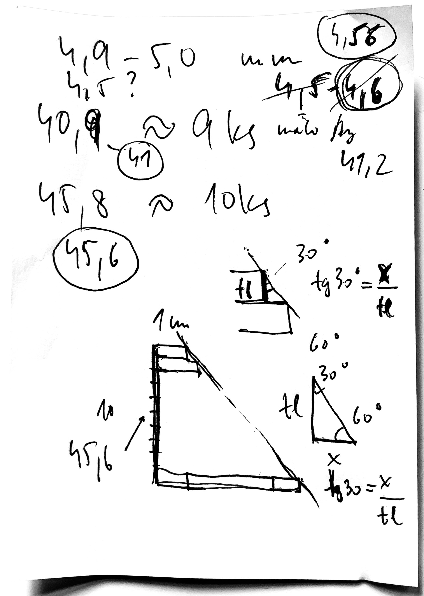

# Koncova zarazka

Chci pripravit zarazku, ktera bude presne zarovnavat listy v uhlu 60stupnu (na obe strany, takze dve zarazky).

Ty latky, ktery pouzivam, maji tloustku 4,56mm. To je rozmer, kterej pouzivam pro vypocty (samozrejme, ze nejsou tak presny). Meril jsem jednu a pak jsem meril 10 vedle sebe a tak nejak to vychazelo.

v mm, pro 16 delek pokud zacnu na 1,5cm

    15
    17.63
    20.27
    22.9
    25.53
    28.16
    30.8
    33.43
    36.06
    38.69
    41.33
    43.96
    46.59
    49.23
    51.86
    54.49

Ufiknout trochu malinko delsi a pak si vzit do suplery rozmer a pak lehce brousit, az to bude odpovidat
